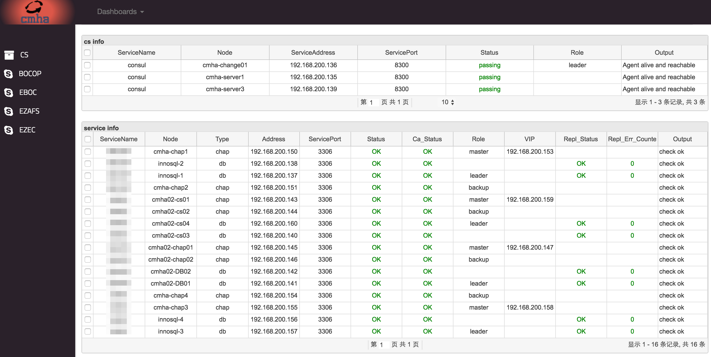
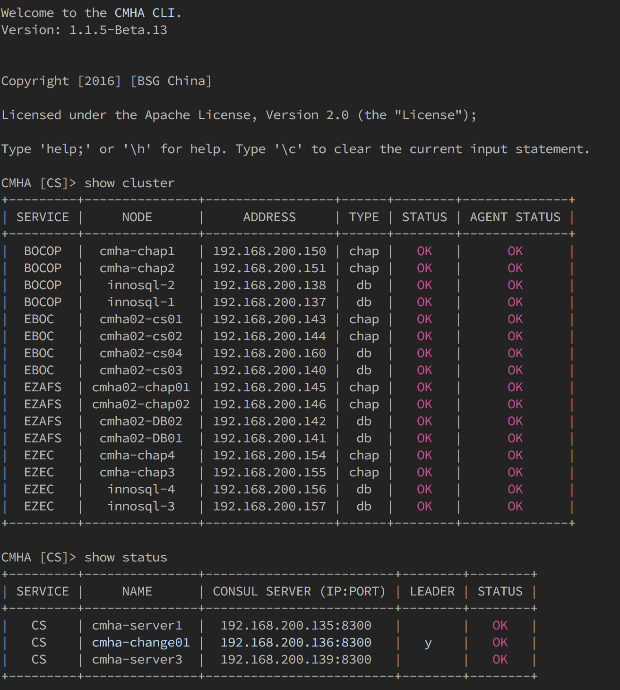
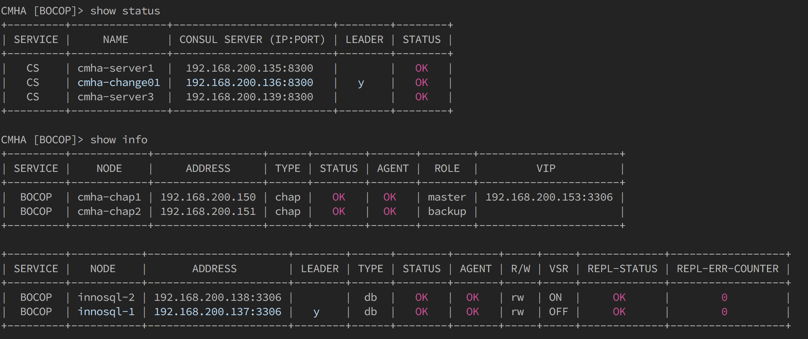

### CMHA 

CMHA is a rock solid MySQL high availability cluster solution for mission critical use case like financial service and telco.

### Getting Started

### Features of CMHA

1. Written in Golang, light weight and very easy to deploy as well as upgrade. 
2. No single point of failure design and strong data consistence, no data lose, no transaction mess.
3. Consul cluster maintains multiple HA groups for different applications.
4. Prevent network partition and MySQL nodes brain-split.
5. Stateless agent design with Run-As-Needed failure handler and health monitoring handler.
6. Interactive command line(CLI) console for DBA's troubleshooting and maintenance.
7. Clear and elegant web UI for status monitoring (embedded web service, no need for additional web server).
8. RESTFul interface for external automation ops tools/platform.
9. User-friendly and customizable deployment scripting
10. Upgrading on the fly 

### Architecture of CMHA

### Screenshot of CMHA Web management

### Screenshot of CMHA Web management

### Contributing
1. Fork it!
2. Create your feature branch: git checkout -b my-new-feature
3. Commit your changes: git commit -am 'Add some feature'
4. Push to the branch: git push origin my-new-feature
5. Submit a pull request :D

### Get Support 
Please use our github issues for bugs, feature requests or questions !

